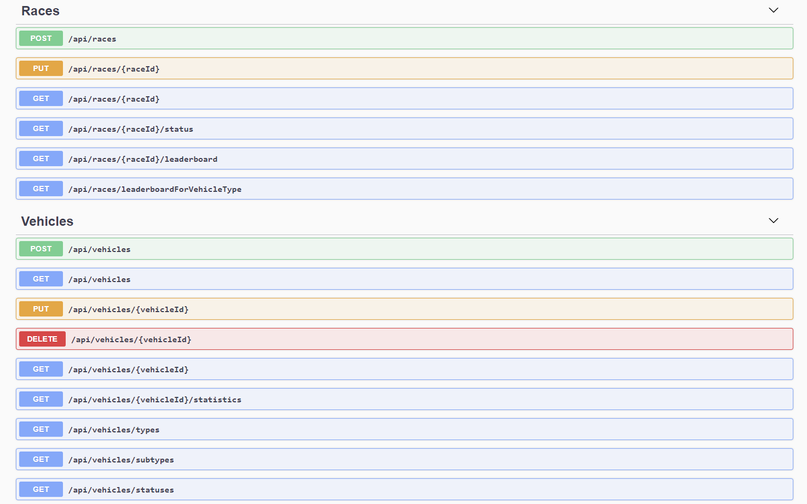

# Rally Simulator :bike: :car: :truck:

\

**Vehicle racing simulator implemented using .NET Core 3.1 and a SQLite in-memory database.**

## Technologies

- .NET Core 3.1
- ASP.NET Core 3.1
- SQLite (In-Memory)
- Entity Framework Core 5.0
- Dapper
- Dynamic LINQ
- MediatR
- FluentValidation
- Swagger
- StyleCop

## System Architecture

The solution utilizes an *onion* styled architecture and consists of multiple layers, where each layer depends only on itself and the layers that are below it in the hierarchy.

### Domain

The domain layer contains all of the entities, value objects, enums, interfaces and logic that is specific to the domain. It does not depend on any other layer in the system.

### Application

The application layer is responsible for orchestrating all of the application logic and the necessary use-cases. It depends on the domain layer, but has no dependencies on any other layer. This layer defines additional interfaces that are required for supporting the application logic, that are implemented by outside layers. For example, the ***IDbContext*** interface is defined in this layer but implemented by the Persistence layer.

This layer utilizes the **CQRS pattern** for structuring the application logic into commands and queries, using the MediatR library.

### Infrastucture

The infrastructure layer contains classes tasked with accessing external resources. These classes are based on the interfaces defined within the application layer. In the current system, this layer is possibly oversimplified and redundant as it contains only the ***MachineDateTime*** class for getting the current UTC date and time.

### Persistence

The persistence layer is responsible for implementing database related concerns. It contains EF Core Configurations for entities, implements the application database context and wires up some persistence related dependencies.

### Api

The Api layer represents the last layer in the onion, and is responsible for glueing the entire system together. The only function of this layer is to accept HTTP requests, package them up into commands or queries, and send them somewhere else in the system to be processed and then return the result of that processing in the response. The controllers are designed to be as *thin* as possible.

## Race simulation

The race simulation is implemented using the **BackgroundService** class, which makes it easy to register a long running background task. The background task starts running as soon as the application starts up, it runs an endless loop searching for a race that is in the *running* state and then processes all of the vehicles of that race - basically simulating *the passing of one hour* during the race. After each loop iteration, the task is dormant for a certain amount of time that is controlled through the application settings. The race is moved to the *completed* state once all of the participating vehicles have either been broke or have completed the race.

## Swagger UI

The Api project will open up the Swagger UI once it starts. Here you can browse the documentation for each endpoint, making it easy to test all of the endpoints.

